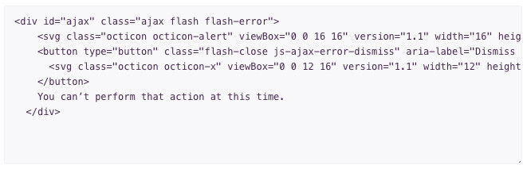

# Code Tool for Editor.js

Code Tool for the [Editor.js](https://ifmo.su/editor) allows to include code examples in your articles.



## Installation

Get the package

```shell
yarn add @editorjs/code
```

Include module at your application

```javascript
import CodeTool from '@editorjs/code';
```

Optionally, you can load this tool from CDN [JsDelivr CDN](https://cdn.jsdelivr.net/npm/@editorjs/code@latest)

## Usage

Add a new Tool to the `tools` property of the Editor.js initial config.

```javascript
var editor = EditorJS({
  ...

  tools: {
    ...
    code: CodeTool,
  }

  ...
});
```

## Config Params

| Field       | Type     | Description                    |
| ----------- | -------- | -------------------------------|
| placeholder | `string` | Code Tool's placeholder string |

## Output data

This Tool returns code.

```json
{
    "type" : "code",
    "data" : {
        "code": "body {\n font-size: 14px;\n line-height: 16px;\n}",
    }
}
```

